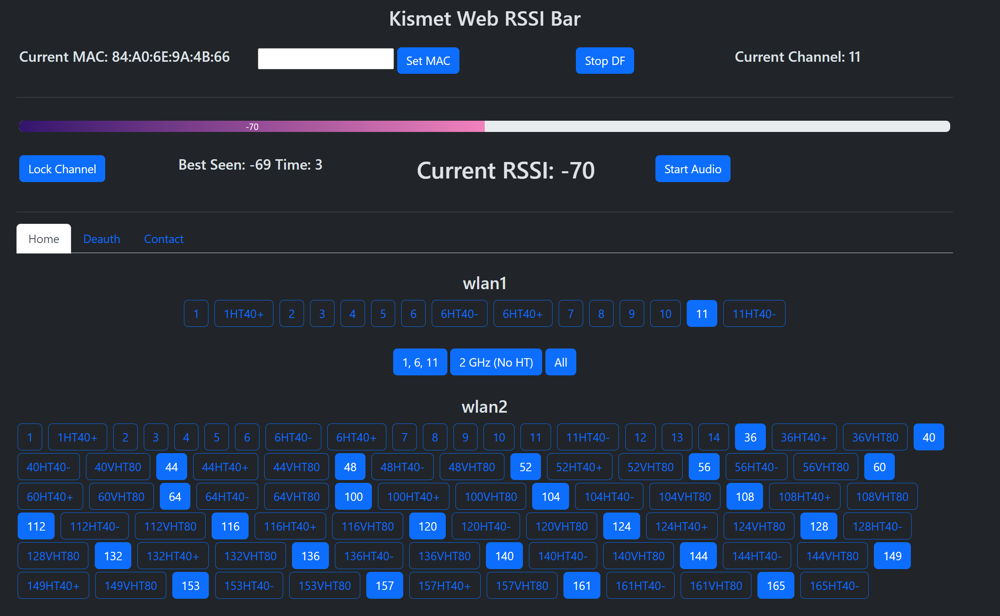

# Kismet Web RSSI Bar

Taking the same idea as the previous tkinter based Kismet RSSI Bar, the web bar is intended to be a Kismet
add on to find Access Points or client devices based on Received Signal Strength Indicator (RSSI) provided
by Kismet. 

## Installation Requirements

````
cd kismet_web_rssi-bar
pip3 install -r requirements.txt
````

## Launching
After Kismet is running, run the following:
````
cd kismet_web_rssi-bar
python3 main.py
````
After launching, navigate to the provided link, which should be the local machines IP at port 5001

## Manual 


Kismet Web RSSI Bar requires an active instance of Kismet to be running to start. The RSSI Bar assumes that the Kismet
server's IP is 127.0.0.1, or localhost. To change that, open mac.py and change self.ip to point to the Kismet server.
To operate the RSSI Bar, a MAC needs to be entered in the input, followed by pressing the Set MAC button. This will change
the label next to the target MAC. Once target is set, hit Start DF button. 

Audio is by default set to mute but can be toggled with the Start Audio button. To change this default behavior, change
the variable mute within static/js/index.js to false. For channel configuration options, the only interfaces that will be
shown are datasources that have already been enabled. The Kismet Web RSSI Bar currently does not allow starting or 
stopping sources. If a new source is added after the RSSI Bar is started, just refresh the page. 

For Deauth functionality to work properly, the below conditions must be met:
* The program must be run with root privileges
* Server must be run on the same machine that is running Kismet
* Server must be run on a Linux machine

### Running Server as Root
To run the server as root, the following command can be used:
````
sudo python3 ../kismet_web_rssi_bar/main.py
````
Remember that to run the server as root, all python libraries will also need to be re-installed as root. 

### Running Server on Kismet Machine
The Deauth functionality is implemented with a Python library called Scapy that interacts with the wlan sources. The way
background commands are written, Scapy assumes that the cards are locally located, and not at a remote Kismet server.
Therefore, if self.IP within mac.py is anything but "localhost" or "127.0.0.1", this functionality will not work. 

It is important to make the distinction that if the Kismet server machine is running the RSSI Bar server as well,
a remote device can send Deauths using the GUI because the commands are executed locally on the Kismet machine, and not
executed on the remote device that is viewing the server. This is the intended utilization of this program.


## Kismet Server Login

Currently, there is no way to modify Kismet username, password, or IP from the server's GUI and must be modified within
mac.py prior to running. By default, username and password are both set to 'kismet' and IP is set to localhost.

## Roadmap

The following is the intended features to be added to this project:

* <s>Default channel hopping combinations (similar to those in offline version of rssi bar)</s>
* Options menu (For ui preferences and Kismet Server changes)
* Active Direction Finding
* Mapping UI

## Issues

For any issues encountered, please email me at grokkedbandwidth@gmail.com with the following:
* Screen capture of terminal output of error (if there is any)
* Detailed description of the issue
* If suggestion, detailed description of what changes you want made

